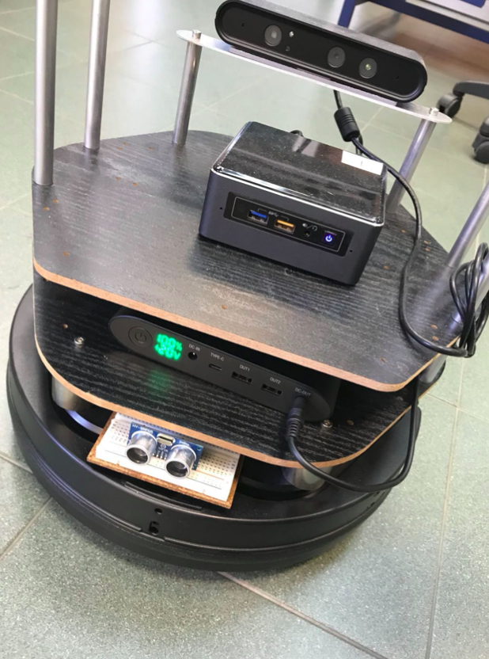
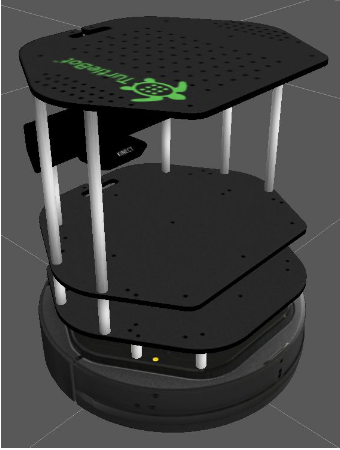
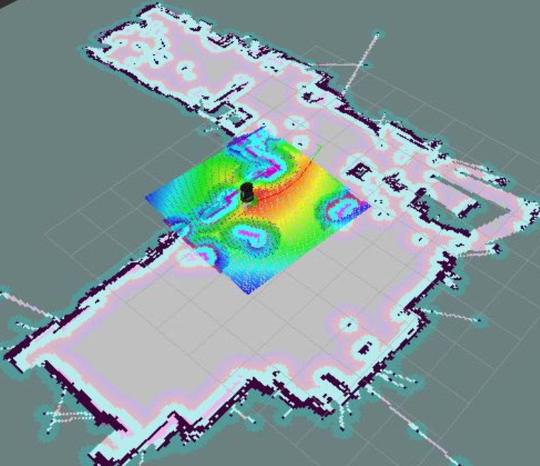

# Mobile-robotics-experimentation-with-Turtlebot-and-ROS
Bachelor's degree (computer engineering) subject: Turtlebot (mobile robot) programming with Python, Matlab and ROS.

Several important topics of Robotics and AI are managed (e.g. odometry check, obstacle detection and avoidance, SLAM) and several tools are used for (e.g. Rviz, Gazebo, Arduino with infrared sensor, Optitrack system)

[Thesis here](docs/TESI.pdf)

[Slide presentation here](docs/slide.pdf)

## Approach and Docs

Here you can find all you need to fine-tune your robot and start with Kobuki Turtlebot (sorry, docs in italian):
https://docs.google.com/document/u/0/d/18C8zv8XhdE-E_kLMsRFaq39zAZBc1QOZlavY0Fe2f0M/mobilebasic

## Turtlebot in real world with infrared sensor (arduino), intel nuc and ASTRA rgb camera

## Turtlebot in Gazebo environment

## Turtlebot in Rviz 3D visualizer, during the SLAM

