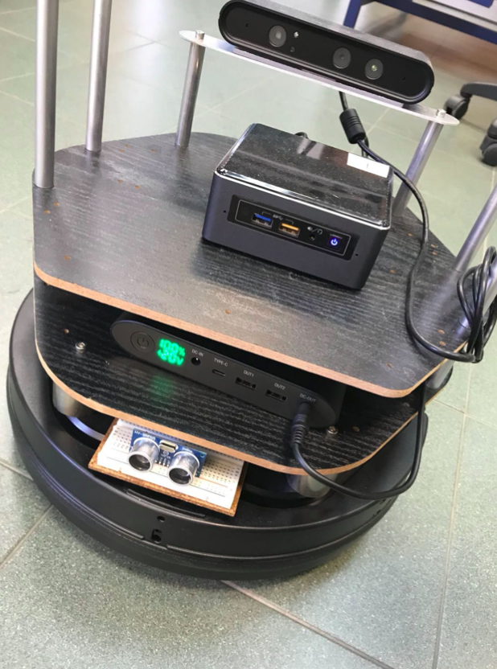
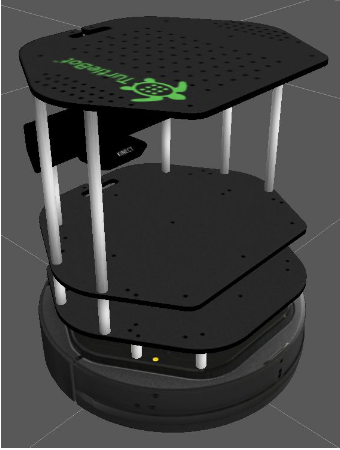

# Mobile-robotics-experimentation-with-Turtlebot-and-ROS
Bachelor's degree subject: Turtlebot (mobile robot) programming with Python and ROS

# Approach and Docs

Here you can find all you need to fine-tune your robot (sorry, docs in italian):
https://docs.google.com/document/u/0/d/18C8zv8XhdE-E_kLMsRFaq39zAZBc1QOZlavY0Fe2f0M/mobilebasic

# Turtlebot in real world with arduino, intel nuc and ASTRA rgb camera

# Turtlebot in Gazebo environment

# Turtlebot in Rviz 3D visualizer, during the SLAM

